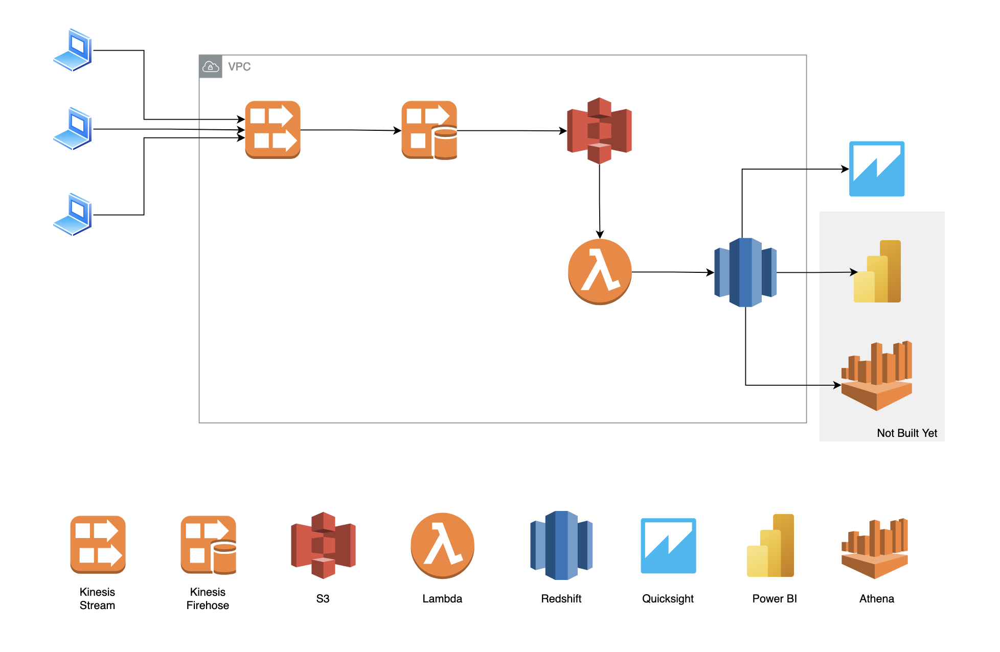
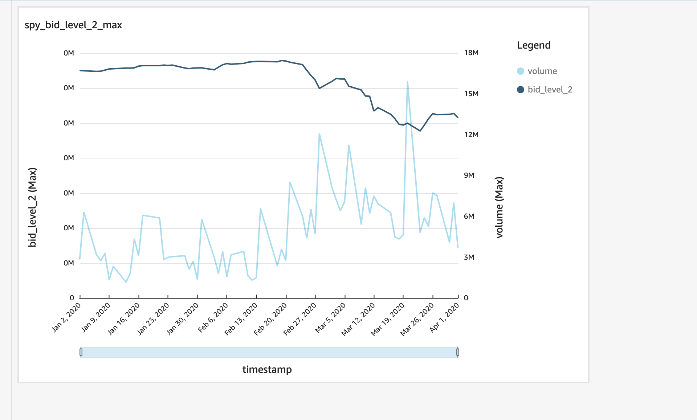

# Outline
This is a data ingestion and storage system. It uses Kinesis to make data ingestion extensible. Batch processing to S3 is done via Firehose which then triggers a Lambda via event notifications to perform the loading into Redshift.

This deploys most resources to a new VPC, but not all.

This is a proof of concept and has a long way to go before being production ready.

[Looker Studio Visual](https://lookerstudio.google.com/reporting/d25a4a8f-178e-42d3-be52-c7e5e71fe0c6/page/fmIHE)

System Design:

# To Deploy
## Prerequisites
1. Place account ID in `ACCOUNT` file.
2. Update backend.tf to specify new S3 bucket for terraform, since buckets are global.
3. Update main.tf#s3_bucket to specify new S3 bucket for data ingestion, since buckets are global.
4. Must have AWS credentials on machine with adequate permissions.

## Interface Via Scripts
- To show plan: `./scripts/plan.sh`
- To deploy: `./scripts/apply.sh`
- To destroy: `./scripts/destroy.sh`
- To place records on kinesis stream: `./scripts/put-records-kinesis-stream.sh`

# Future Improvements
- Automate copying from S3 to Redshift via auto-copy.
    - This runs the `COPY JOB` feature, which is still in preview until 10/31/2024.
    - This removes the need for this lambda, which just executes a SQL statement on the Redshift cluster, to perform a `COPY`.
    - https://aws.amazon.com/about-aws/whats-new/2022/11/amazon-redshift-supports-auto-copy-amazon-s3/
- Make Kinesis Firehouse convert csv to Parquet.
    - To do this, you need to define your schema in a Glue Data Catalog. This shouldn't be hard, I just ran out of time.
- Move Lambda into VPC.
    - This isn't hard, but the routing table and NAT gateway need to be built so the lambda can talk to other services outside the VPC. I just didn't have time to implement.
- Handle most operations with Redshift in a supervised manner eg using step functions. This is because the redshift-data API is async so you need something to poll for results.
- Add init statment when Redshift Cluster is built
    - using `aws_redshiftdata_statement`, we can define the DDL and remove the workaround in `scripts/apply.sh`.
- Solve `aws_redshift_cluster.default_iam_role_arn` issue
    - AWS TF provider plugin throws a nebulous error, hence the workaround in `scripts/apply.sh`.
- Restrict permissions in security groups, IAM roles.
- Store credentials in Secrets Manager and ecrypt with KMS.
- Improve lambda code.
    - Remove hardcoding of table name in query.
    - Unmarshall event records object into class so can do better/safer data accessing.
    - Catch/raise errors.
    - Use logging package.

# Analysis of Redshift
- Three main drivers of performance are distribution key, sort keys, and compression.
- Test your compression method via `ANALYZE COMPRESSION <table>` where you've loaded a sample of data into `<table>`.
- You control the distribution method and sort key. Other providers might optimize this for you. Queries will be slow if the distribution method and sort key isn't optimized.
- You need a clear idea of how you're accessing your data.
- `distribution key`
    - How to distribute data across storage nodes.
    - Heuristic - set distribution key where JOINS are used most between tables. This will distribute storage on same nodes so less reshuffle and faster performance.
- `sort key`
    - Defines physical order in which data is stored on each node.
    - Heuristic - set sort key for columns being filtered (eg when `where` statement is used). This makes sense - sorted data will be in same or near block storage, and the engine can locate sorted data faster.
    - `compound sort key`
        - Made from all columns listed in sort key definition.
        - Good when query filters apply conditions - eg filter/join.
        - `SORTKEY (city, state)` - sort key made of city/state.
    - `interleved sort key`
        - Gives equal weight to each column, or subset of columns in sort key.
        - Use when query uses `restrictive predicates` on secondary sort columns.
            - This drastically improves performance.
        - Use when queries use different columns for filtering, as this is performant.
- Does MPP but you need RA3 to have seperate compute and storage.
    - Older instances will still have compute/storage on same node. This will make scaling harder - if you need to scale your compute for burst activity, you will need to first copy data to new compute node.
- Integrating Redshift into an AWS ecosystem is easy/intuitive.
- Redshift spectrum:
    - Query structured/ semi-strictured data from s3.
    - Don't need to load into redshift tables.
- Connecting redshift to Quicksight is quick and visualizations are very easy/intuitive.
    - You can also hook up Redshift to Looker, Power BI, Tableau.
- Treat this as OLAP, not OLTP
    - This is better suited to analytics (querying) than a transactional DB (CRUD actions).
    - This will not dedupe like a transactional DB. Must be mindful of ingesting from multiple sources.

## Use Cases
- Real time analytics - eg Uber setting surge pricing, matching drivers and riders, expected traffic for holidays
- Combining data sources. Can combine strucutred/unstrucutred data.
- Should consider RDS if you don't actually have large volues of data (< petabytes) now or in near future

## Benchmark
- benchmark COPY and QUERY.

## Miscellaneous Notes
- The redshift-data API mostly works asynchronously. This make sense given some operations could take hours/days. 
- Redshift-data API integrates other services and can be done for ingestion, while COPY command can be used to load from Se, dynamo, ERM etc. 

# Alternatives
- snowflake, databricks, bigquery
- these are more expensive but optimize distribution, schemas automatically
- outside AWS echosystem
- for snowflake (and others I'm sure), you can connect it to Firehose
- tradeoff - more expensive + outside AWS vs. AWS service, need to spend time optimizing cluster

# Appendix
- Quicksight SPY bid price. Data fetched from Redshift.
